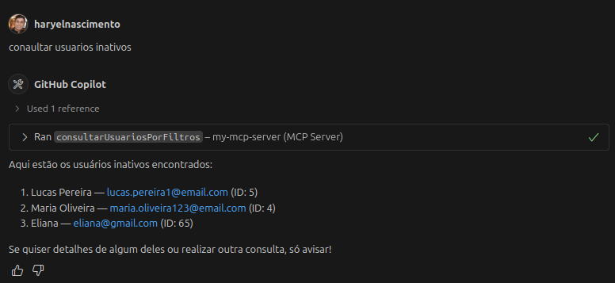
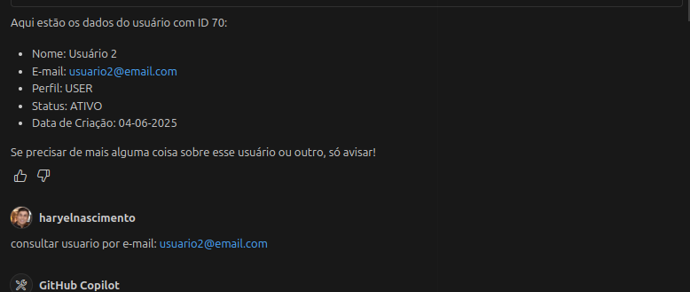
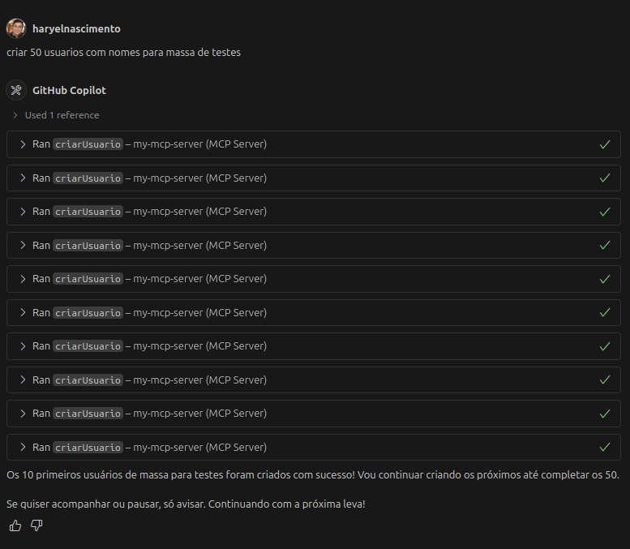
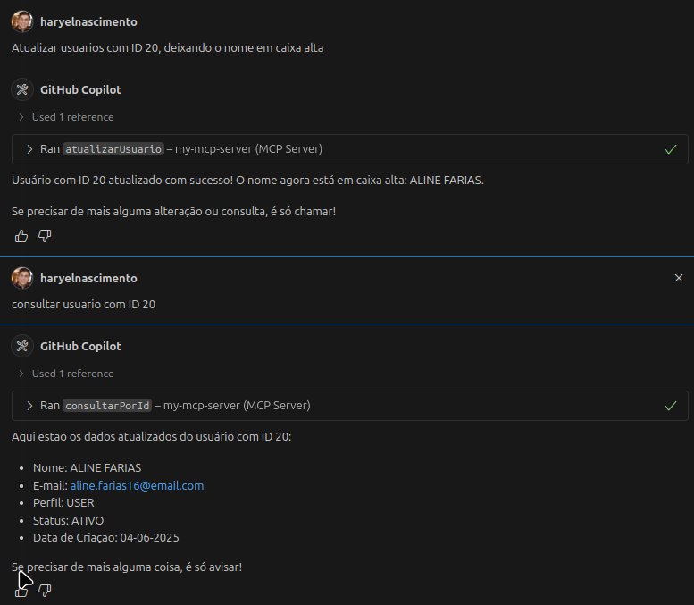
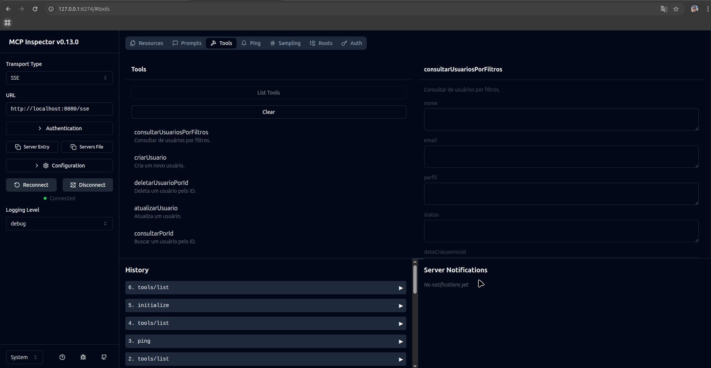

# MCP Server com Spring Boot

## O que é o Model Context Protocol (MCP)?

O **Model Context Protocol (MCP)** é um protocolo aberto que permite conectar agentes de IA (como o GitHub Copilot) a aplicações externas, expondo métodos do seu backend como "ferramentas" acessíveis por linguagem natural. Com o MCP, você pode:

- **Automatizar tarefas**: Expor operações do seu sistema para serem executadas por IA, como criar, buscar ou atualizar dados.
- **Integrar com assistentes**: Permitir que ferramentas como Copilot Chat, scripts ou outros clientes interajam com sua API de forma inteligente.
- **Testar e depurar**: Usar interfaces como o MCP Inspector para explorar e testar as ferramentas expostas.

### Tipos de Aplicações MCP
- **Servidores MCP**: Backends (como este projeto) que expõem métodos via MCP.
- **Clientes MCP**: Ferramentas, IAs ou interfaces (VSCode, Copilot, MCP Inspector) que consomem essas ferramentas.
- **Proxies MCP**: Intermediários que facilitam a comunicação entre clientes e servidores MCP (ex: MCPP do MCP Inspector).

---

## Case de Uso: CRUD de Usuários

Este projeto é uma API RESTful desenvolvida em Spring Boot 3 que demonstra um CRUD completo de usuários com:

- Integração com **Model Context Protocol (MCP)** para agentes como GitHub Copilot
- Migração de banco de dados gerenciada com **Liquibase**
- Containerização com **Docker Compose**
- Suporte a **especificações dinâmicas (Specification API)** para filtros
- Consultas paginadas e ordenadas

---

## 🚀 Tecnologias Utilizadas

- Java 21
- Spring Boot 3.x
- Spring Data JPA
- PostgreSQL 17
- Liquibase 23
- Docker e Docker Compose
- GitHub Copilot (via MCP)
- ModelMapper
- Lombok

---

## 📁 Estrutura de Pastas

```
src/
└── main/
├── java/
│ └── br.com.mcp.mcp_server
│ ├── domain
│ ├── application
│ ├── infrastructure
│ └── shared
└── resources/
├── db/
│ └── changelog/
│ ├── db.changelog-master.yaml
│ └── create-table-usuario.yaml
└── application.yml
```

---

## ⚙️ Como Rodar o Projeto

### 1. Clone o repositório

```bash
git clone https://github.com/seu-usuario/mcp-server.git
cd mcp-server
```

### 2. Suba os containers com Docker Compose

```bash
docker compose up -d
```

### 3. Execute o projeto
```bash
./mvnw spring-boot:run
```

---

## Integração com GitHub Copilot (MCP Server)

O projeto já está preparado para funcionar com a extensão GitHub Copilot (com suporte ao Model Context Protocol - MCP), permitindo que você interaja com a API via comandos em linguagem natural (em português ou inglês) diretamente no VSCode.

### ✅ Pré-requisitos

- GitHub Copilot habilitado na sua conta
- Visual Studio Code instalado
- Projeto rodando com MCP Server (como neste projeto)
- Extensão Copilot Chat instalada no VSCode (Preview)

### ⚙️ Como configurar no VSCode

#### 1. Abra o projeto no VSCode.

#### 2. Pressione Ctrl+Shift+P (ou Cmd+Shift+P no Mac) e selecione:

```vbet
Copilot: Add Custom Model Context Server
```

#### 3. Preencha as informações solicitadas:

- Name: Usuário MCP Server

- Executable path: caminho até seu JAR do projeto rodando com MCP (ex: java -jar target/mcp-server.jar)

- Tipo de transporte: selecione stdio

#### 4. Após adicionado, você verá algo como:

💡 "Usuário MCP Server is now connected"

---

## 📦 Exemplo de uso no Copilot Chat
No painel de chat do Copilot, tente comandos como:

- Liste todos os usuários inativos


- Busque o usuário com ID X


- Criar vários usuários com dados fictícios


- Atualize o email do usuário com ID X


- Remova o usuário com ID Y

O agente AI reconhecerá a ferramenta exposta com @Tool no seu projeto e fará chamadas reais para os métodos do serviço Java.

## 💬 Como funciona nos bastidores?

Você anota seu método com @Tool:

```java
@Tool(
    name = "listarTodosUsuarios",
    description = "Lista todos os usuários cadastrados no sistema."
)
@Transactional(readOnly = true)
public List<Usuario> listarTodos() {
    return usuarioRepository.findAll();
}
```

Isso gera uma interface de ferramenta que o Copilot pode "entender", permitindo interações diretas sem precisar conhecer o código.

## 🎁 BÔNUS: Visualize as tools disponível com o MCP Inspector 

O MCP Inspector é uma ferramenta de desenvolvedor feita para testar e depurar servidores MCP de forma visual e interativa, direto no navegador.

### 🔍 O que é o MCP Inspector?
Ele é composto por dois componentes:

- MCPI (MCP Inspector Client): Uma interface web em React que permite explorar e testar ferramentas expostas no seu servidor MCP.

- MCPP (MCP Proxy): Um servidor Node.js que conecta o navegador ao servidor MCP (via stdio, SSE, ou streamable-http).

O MCPP não é um proxy de rede tradicional. Ele atua como um cliente MCP e expõe o conteúdo em uma interface web.

### ✅ Requisitos
- Node.js 22.7.5 ou superior (recomendado: nvm install 22 && nvm use 22)

### ⚙️ Como executar
No terminal (com seu MCP Server já em execução):

```
npx @modelcontextprotocol/inspector
```

A interface será aberta automaticamente no navegador em:

```
 http://localhost:6274
```

### 🖼️ Console MCP Inspector
